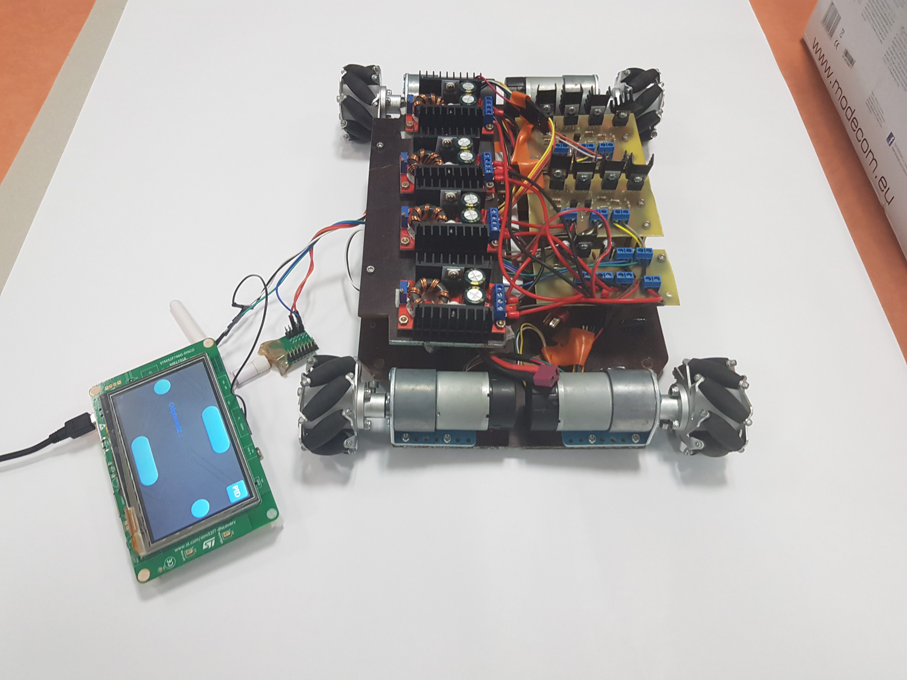
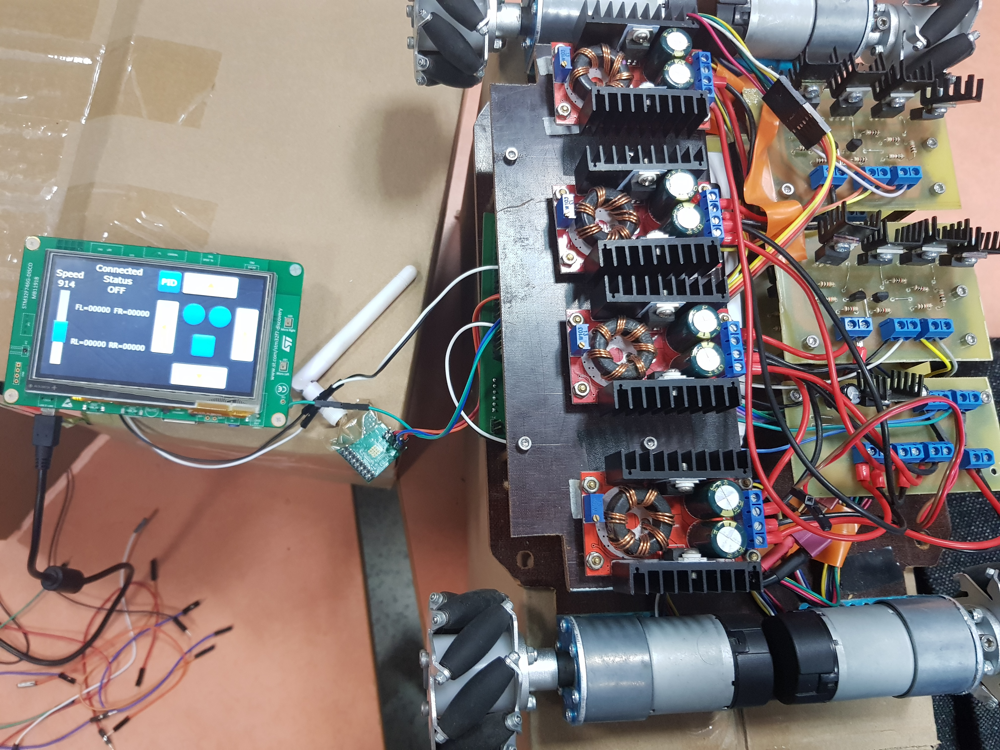
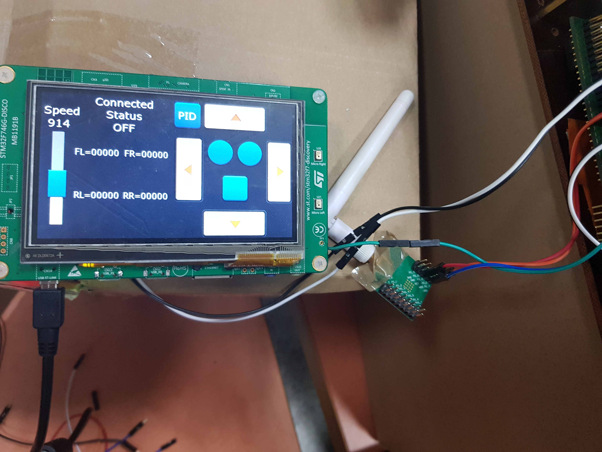

Krakow, the 15.01.2020
 

##AGH University of Science and Technology
>Faculty:     &nbsp;         Mechanical Engineering and Robotics
>Field of  Study: &nbsp;  Automatics Control and Robotics

### Engineer Diploma Thesis
>Implementation of the HMI panel on a discovery kit containing a STM32 microcontroller.

Author: &nbsp; _eng. Szymon Kwieciński_
Supervisor: &nbsp; _dr. eng. Łukasz Jastrzębski_

<h3 align="center" id="header">Sumary</h3>

The purpose of the Engineering Thesis was to create a touch panel, which can be used to control the mobile robot. In my work, I discuss issues related to HMI panels, such as: providing basic definitions, discussing software, presenting applications, and commercial solu-tions. The next part of my thesis is focused on the subject of microcontrollers. Then, I present their basic definitions and possible applications. In details, I discuss the offer of STMicroelectronics microcontrollers and microprocessors, introducing the four main family products. I present two development kits with STM32 microcontrollers. Finally, I describe the software and libraries for STM32 microcontrollers that I used in my project. After a theoretical part, in which I describe issues related to microcontrollers and HMI panels, I go to the design and practical part. I present the design assumptions based on which I selected the components for the project. Then, by the use of a block diagram, I clearly explain the logic of functioning the HMI panel, which controls the mobile robot. In the next part, I design a graphical interface of the panel and describe its practicality. Subsequently, I thoroughly describe the program, which I wrote in C language for the STM32 microcontroller. For creating the program I used real-time system libraries, so I could divide microcontroller resources into two main groups. The first one is responsible for operating the touch screen. The second one for peripheral support and all program logic. Afterwards, I performed three functional tests: checking wired and wireless communication, controlling the robot and receiving feedback from the robot.

---
* [Link to Engineering thesis](https://drive.google.com/file/d/14FZgkoUxqxhLuxade8oF_x2I-tRbyFQE/view?usp=sharing)

* [Link to full presentation movie](https://youtu.be/R8Yqq7nlyo0)

---

